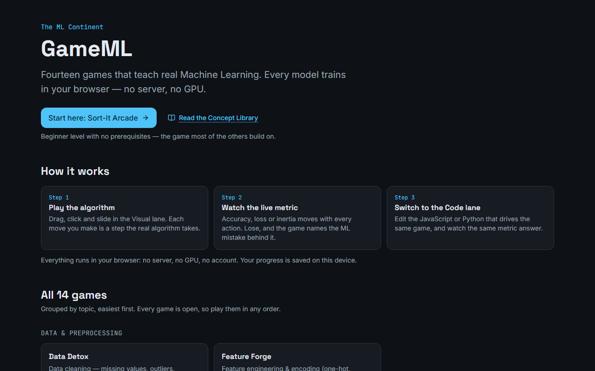
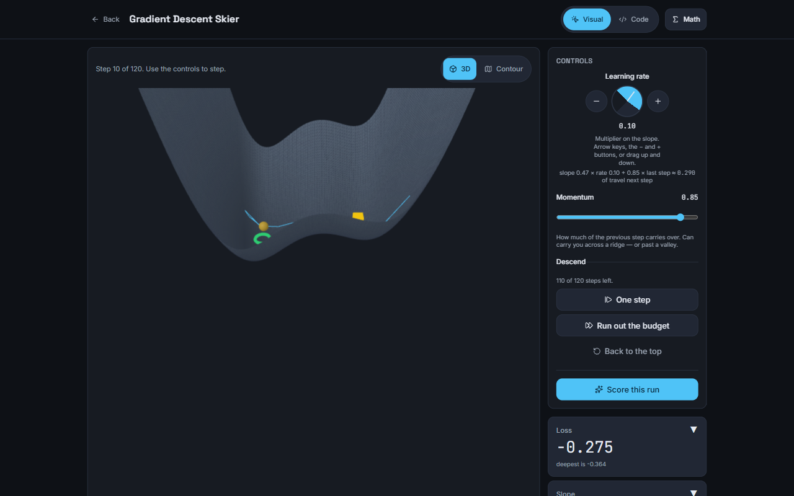
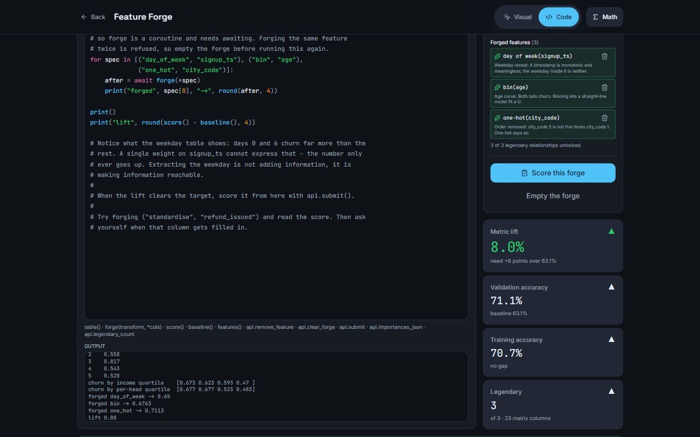
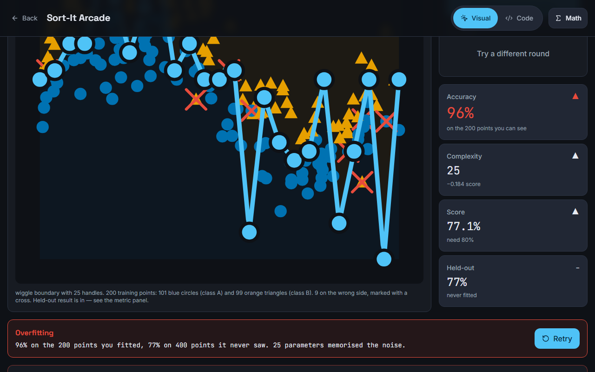
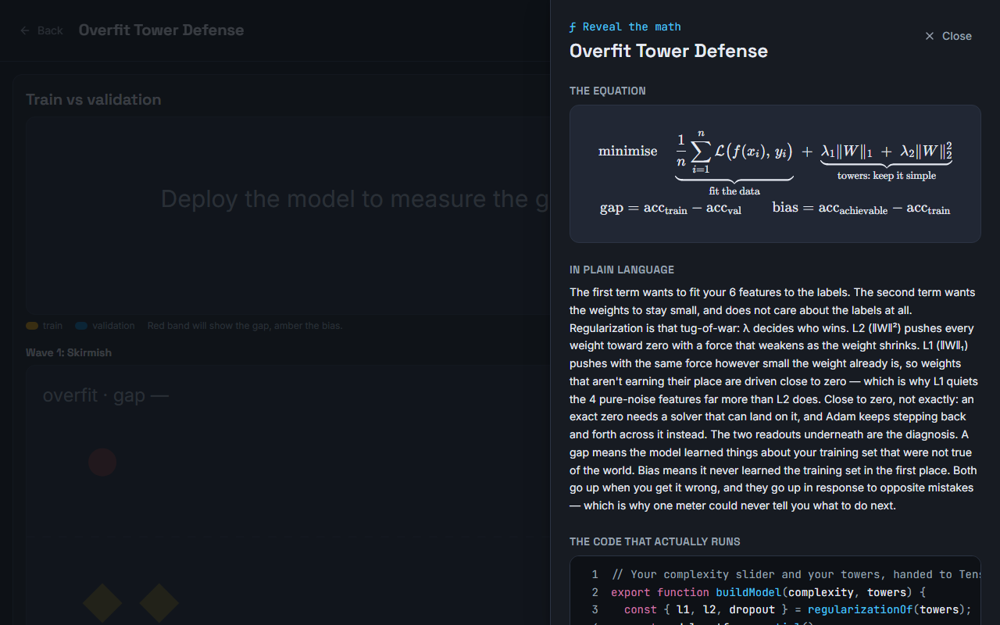
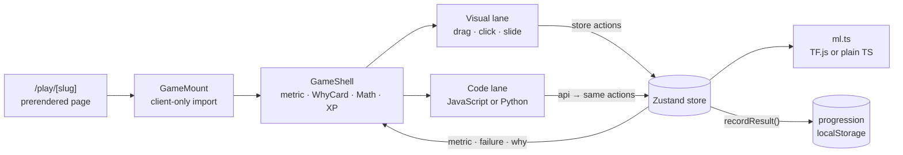

<div align="center">


# GameML

**Learn machine learning by playing it.**

Fourteen browser games that teach real ML. You make the moves the algorithm makes,<br>
a live metric answers every move, and when it goes wrong, the mistake has a name.

[](https://playto-learn-ml.vercel.app)

[](https://github.com/NiravRVaghasiya/PlaytoLearnML/actions/workflows/ci.yml)
[](LICENSE)


**[▶ Play now](https://playto-learn-ml.vercel.app)** · [Games](#-the-games) · [How it works](#-how-it-works) · [Run locally](#-getting-started) · [Contribute](#-contributing)

</div>

## ✨ Features

GameML has 14 games across 6 ML categories, from Beginner to Advanced, and every one is open. **All ML runs in your browser**: no ML server, no account, no GPU required.

- 🧩 **Two lanes, one game.** Play in the visual lane (drag, click, slide) or the code lane, which is editable JavaScript, or real Python + pandas in Feature Forge. Both drive the same game state.
- 📈 **Live feedback.** The metric (accuracy, loss, inertia…) is shown in both lanes and moves with every action. A *"Why did that happen?"* card explains your last move.
- 💥 **Named failures.** Losing names the ML mistake (*Overfitting*, *Divergence*, *Reward hacking*) instead of saying "Game Over".
- 🧮 **Reveal the Math.** One click opens the real equation, rendered with KaTeX, next to the code behind it.
- 📚 **Concept Library.** Eight plain-language [explainers](https://playto-learn-ml.vercel.app/concepts) (decision boundaries, overfitting, k-means, choosing *k*, data cleaning, missing data, gradient descent, learning rate). The "Why did that happen?" cards in 11 of the games link into them.
- 🏅 **Progress.** XP, three mastery stars and a concept badge per game, saved in your browser. The third star needs a clear made through the code lane.
- ♿ **Accessible.** Keyboard-operable controls, ARIA live regions, Okabe–Ito class colours, and meaning is never carried by colour alone. CI fails any page that scores under 95 on Lighthouse accessibility, on desktop or mobile.
- 🔒 **Self-contained.** In production, a Content Security Policy keeps every request on the site's own origin: no third-party scripts, fonts or APIs.

## 📸 Screenshots & demo



<table>
  <tr>
    <td width="50%"><br><sub><b>Visual lane.</b> Gradient Descent Skier after 10 steps at learning rate 0.10 and momentum 0.85.</sub></td>
    <td width="50%"><br><sub><b>Code lane.</b> Feature Forge's Python, on real Pyodide and pandas, forges three features for an 8.0% lift.</sub></td>
  </tr>
  <tr>
    <td width="50%"><br><sub><b>Named failure.</b> Sort-It Arcade's 25-handle wiggle scores 96% on training points and 77% held out: <i>Overfitting</i>.</sub></td>
    <td width="50%"><br><sub><b>Reveal the Math.</b> Overfit Tower Defense's equation (KaTeX), a plain-language reading and the code that runs.</sub></td>
  </tr>
</table>

Four good first stops on the live site:

| Play | What happens |
|---|---|
| [**Sort-It Arcade**](https://playto-learn-ml.vercel.app/play/sort-it-arcade) | Fit a line, curve or wiggle boundary. The wiggle can ace the training points and still lose on held-out ones: *Overfitting*. |
| [**Gradient Descent Skier**](https://playto-learn-ml.vercel.app/play/gradient-descent-skier) | Pick a learning rate and momentum on a 3D loss terrain or its contour map. Too big a step and you get *Divergence*. |
| [**Neuron Forge**](https://playto-learn-ml.vercel.app/play/neuron-forge) | Stack layers, pick their neurons and activations, and train a real TensorFlow.js network on puzzles up to XOR and a spiral. |
| [**Feature Forge**](https://playto-learn-ml.vercel.app/play/feature-forge) | Explore the data in real Python and pandas, running in your tab, then forge features from what you find. Build one from a column that leaks the answer and it's flagged as *Leakage*. |

## 🎮 The games

| Category | Game | You learn | Live metric | Named failure | Runs on |
|---|---|---|---|---|---|
| 🧹 **Data & Preprocessing** | [Data Detox](https://playto-learn-ml.vercel.app/play/data-detox) | Missing values, outliers, the cost of dropping rows | Accuracy | Data starvation | TF.js |
| | [Feature Forge](https://playto-learn-ml.vercel.app/play/feature-forge) | Feature engineering and encoding | Metric lift | Leakage | TF.js · Python |
| 🎯 **Supervised Learning** | [Sort-It Arcade](https://playto-learn-ml.vercel.app/play/sort-it-arcade) ⭐ | Decision boundaries | Accuracy | Overfitting | TypeScript |
| | [Confusion Matrix Chef](https://playto-learn-ml.vercel.app/play/confusion-matrix-chef) | Precision, recall, F1, thresholds | Set per scenario | Accuracy paradox | TypeScript |
| | [Decision Tree Architect](https://playto-learn-ml.vercel.app/play/decision-tree-architect) | Information gain, tree depth | Validation accuracy | Overfit depth | TypeScript · React Flow |
| 🧠 **Neural Networks** | [Neuron Forge](https://playto-learn-ml.vercel.app/play/neuron-forge) | Layers, neurons, activations | Loss | Dying ReLU | TF.js · React Flow |
| | [Convolution Kitchen](https://playto-learn-ml.vercel.app/play/convolution-kitchen) | CNN filters, feature maps, pooling | Detection score | Dead filters | TF.js |
| | [Backprop Blitz](https://playto-learn-ml.vercel.app/play/backprop-blitz) | Backpropagation and the chain rule | Gradient correctness | Broken chain rule | TypeScript |
| 📉 **Optimization & Tuning** | [Gradient Descent Skier](https://playto-learn-ml.vercel.app/play/gradient-descent-skier) | Learning rate, momentum, minima | Loss | Divergence | TypeScript · Three.js |
| | [Overfit Tower Defense](https://playto-learn-ml.vercel.app/play/overfit-tower-defense) | Bias–variance, regularization | Train/val gap | Overfitting | TF.js |
| | [Hyperparameter Heist](https://playto-learn-ml.vercel.app/play/hyperparameter-heist) | Grid vs random vs Bayesian search | Best objective | Grid trap | TypeScript |
| 🔍 **Unsupervised Learning** | [K-Means Territory Wars](https://playto-learn-ml.vercel.app/play/k-means-territory-wars) | Clustering, choosing *k* | Inertia | Bad k | TypeScript |
| | [Dimension Diver](https://playto-learn-ml.vercel.app/play/dimension-diver) | PCA | Variance retained | Lost variance | TypeScript · Three.js |
| 🤖 **Reinforcement Learning** | [Agent Academy](https://playto-learn-ml.vercel.app/play/agent-academy) | Rewards, exploration, Q-learning | Episode reward | Reward hacking | TypeScript |

⭐ Start here. **TF.js** games train a TensorFlow.js model in your tab. **TypeScript** games run the algorithm itself, written without an ML library (CART, k-means, PCA, a Gaussian process, Q-learning, autograd…). Most games can name several failures; one is shown.

## 🧠 How it works

Every game satisfies a four-part **pedagogy contract**: a one-sentence *core intuition*, a *player action that mirrors the algorithm*, *live feedback* from a real metric, and a *named failure mode*.



- **One store, two lanes.** The code lane's `api` calls the same store actions as the visual controls.
- **Shared engine.** All 14 games run in the same `GameShell` and share `useCodeLane` and `progression`. Nothing is forked per game.
- **Your code runs in the tab.** JavaScript snippets execute directly in the page. Python runs in Pyodide. Like a browser console, neither is a sandbox.
- **Static by default.** Every page is prerendered, and there are no API routes or server-side inference.

## 🧰 Tech stack

| Layer | Choice |
|---|---|
| Framework | Next.js 16 (App Router) · React 19 · TypeScript 5.9 |
| In-browser ML | TensorFlow.js 4.22 in 5 games; plain TypeScript algorithms in the other 9 |
| Python in the browser | Pyodide 314 + pandas, self-hosted under `/pyodide/` (about 20 MB, loaded on the first Python run) |
| Views | SVG with D3 scales · 2D canvas for Convolution Kitchen's pixel maps · Three.js for two 3D views, both playable without WebGL · React Flow network and tree diagrams |
| Math | KaTeX |
| State & progress | Zustand (one store per game) · localStorage |
| Styling | Tailwind CSS 4 + the tokens in [`DESIGN.md`](DESIGN.md) |
| Testing | Vitest + Testing Library · Playwright playthroughs · Lighthouse |
| Tooling & hosting | bun 1.3.13 · Node 22 · ESLint (jsx-a11y rules are errors) · GitHub Actions · Vercel |

## 🚀 Getting started

**Prerequisites:** [bun](https://bun.sh) 1.3.13 and Node.js 22 (≥ 22.22.2, < 23). The first run needs network access to download the pandas wheels (checksum-verified) and the fonts that `next/font` self-hosts.

```bash
git clone https://github.com/NiravRVaghasiya/PlaytoLearnML.git
cd PlaytoLearnML
bun install
bun run dev        # → http://localhost:3000
```

No environment variables are needed. `dev` and `build` first run `scripts/setup-pyodide.mjs`, which stages the Python runtime into the gitignored `public/pyodide/`.

| Command | What it does |
|---|---|
| `bun run dev` | Dev server on port 3000 |
| `bun run build` · `bun run start` | Production build · serve it on port 3000 |
| `bun run verify` | Typecheck, lint and the Vitest unit suite |
| `bun run test` | Vitest in watch mode |
| `bun run verify:play [slug]` | Plays every game (or one) in headless Chromium |
| `bun run verify:mobile` | Every route at 360×740: overflow, landmarks, live metric |
| `bun run audit:a11y` | Lighthouse accessibility ≥ 95, desktop and mobile |

The last three need a running server and a one-time `bunx playwright install chromium`. The unit suite takes several minutes because the TF.js models really train.

**Deploying your own:** import the repo into Vercel. No `vercel.json` is needed. Keep the build command as `bun run build`, because a bare `next build` skips the Pyodide staging.

📘 The [development guide](docs/DEVELOPMENT.md) covers optional env vars, CI, deployment checks and known limitations.

## 📁 Project structure

```text
PlaytoLearnML/
├── src/
│   ├── app/            # routes: /, /play/[slug], /concepts, /concepts/[slug]
│   ├── engine/         # shared: GameShell, useModel, useCodeLane, progression
│   ├── components/     # MetricReadout, WhyCard, MathDrawer, CodeEditor, …
│   ├── games/<slug>/   # one folder per game: store · ml · VisualLane · CodeLane · why-cards · tests
│   └── lib/            # game catalog, Concept Library, site metadata
├── scripts/            # Pyodide staging, browser playthroughs, phone and a11y harnesses
├── docs/               # build spec, engine API, development guide, screenshots
├── DESIGN.md           # design system and accessibility rules
└── CLAUDE.md           # build rules: pedagogy contract, Definition of Done
```

## 🤝 Contributing

[`CLAUDE.md`](CLAUDE.md) is the build contract, so read it first. A game ships only when it meets the pedagogy contract and has both lanes.

1. Start from the game's entry in [`docs/GameML_Build_Spec.md`](docs/GameML_Build_Spec.md).
2. Build `src/games/<slug>/`: `store.ts` → `ml.ts` → `VisualLane.tsx` → `CodeLane.tsx` → `why-cards.ts`.
3. Unit-test the ML logic and the live-metric binding.
4. Register the game in the five places `CLAUDE.md` lists (catalog, registry, `GameMount`, badges, playthrough). Tests fail if one is missing.
5. Run `bun run verify`. Then, with a server running, run `verify:play <slug>`, `verify:mobile /play/<slug>` and `audit:a11y http://localhost:3000/play/<slug>`.

Use Conventional Commits (`feat(games): …`), one game per PR, and list the pedagogy-contract points you satisfied. The `.claude/` folder has a `new-game-module` skill and `/new-game` and `/verify-game` commands for AI-assisted work.

## 📄 License

Released under the [MIT License](LICENSE). © 2026 NiravRVaghasiya.
